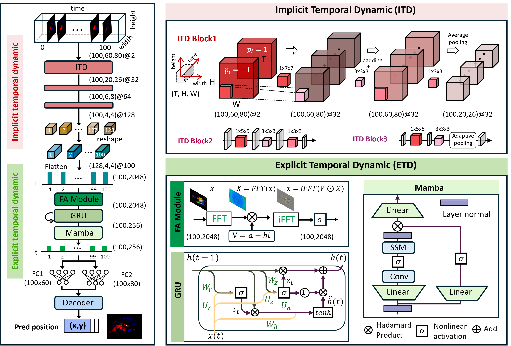

# TDTracker: Event-based Eye Tracking Challenge - CVPR 2025 - Third Place Solution
### Exploring Temporal Dynamics in Event-based Eye Tracker

### Usage
1. Prepare the data:

        cd dataprocess
        python 3et_plus.py

2. Put the train_aug.h5 and test_aug.h5 to ./data/xxx/:

3. Modify data_path, log_name and others.

4. Run the train script:
    
        python train.py
5. Run the test script to generate initial CSV (MSE: 1.5532):

        python test.py

6. Run the test script to generate initial CSV (MSE: 1.4932):

        python post_process.py

### Download

| Dataset    | Sequence  Length  | Processed Data|
| ---------- | -------- | -------- |
| 3ET+ 2025 |  100 |   [DOWNLOAD](https://pan.baidu.com/s/11-zaux8WKvGqIOBQuUlK3g?pwd=hsft) |
| SEET   | 100 | [DOWNLOAD](https://pan.baidu.com/s/1-Aqv_NkDaXMp-zg805egVQ?pwd=nckr)  |

### Acknowledgment

Special thanks to the 2024 eye-training team ([Mambapupil](https://arxiv.org/abs/2404.12083), [TENNs](https://openaccess.thecvf.com/content/CVPR2024W/AI4Streaming/papers/Pei_A_Lightweight_Spatiotemporal_Network_for_Online_Eye_Tracking_with_Event_CVPRW_2024_paper.pdf)) for providing ideas.